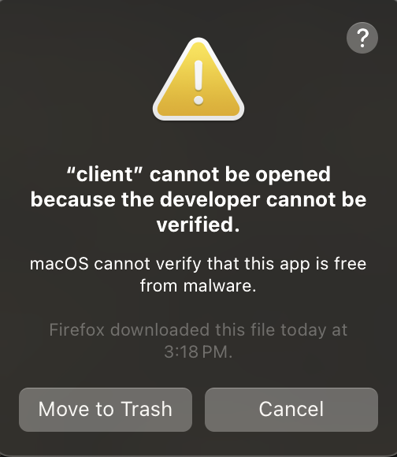
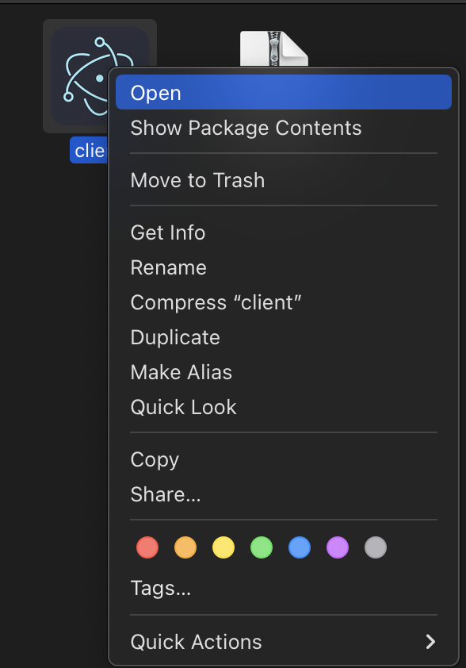
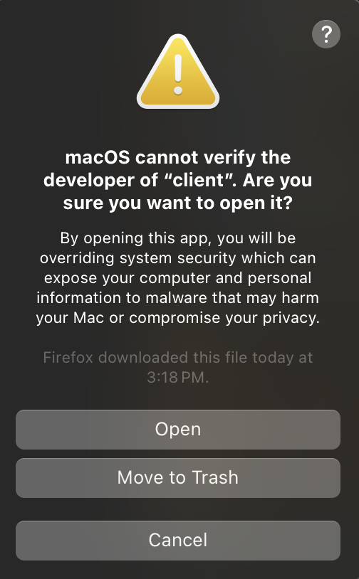
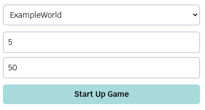
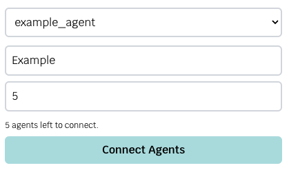
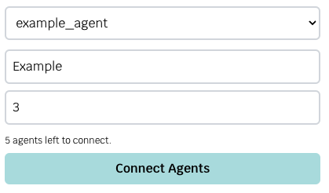
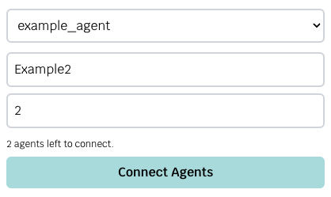

This section will cover how to run AEGIS.

## How to run AEGIS

There are two ways to run AEGIS: using the provided script or via the Client.

### Using the provided script

To run AEGIS in the command line, use the `run_headless_aegis_with_agents.py` script.

The usage of the python script is shown below:

```bash
python run_headless_aegis_with_agents.py <agent amount> <num of rounds> <agent directory> <world file>
```

Example:

```bash
python run_headless_aegis_with_agents.py 2 50 example_agent ExampleWorld
```

- The program will automatically append `.world` to the world file passed in.
- Pass in the directory name of your agent.

This will start up AEGIS with the ExampleWorld.world, using 2 example agents, and will run for 50 rounds.

If you installed packages globally on Mac or Linux, you might have to use `python3` instead of `python`.

### Via the Client 

Make sure you open the client from the command line.

```bash
cd client
```

=== ":fontawesome-brands-windows: Windows"

    ```
    .\aegis-client.exe
    ```

=== ":fontawesome-brands-apple: Mac"

    ```
    open AEGIS.app
    ```

    You might get the following error.

    

    To fix it you can do the following:

    ```
    open .
    ```

    

    

    Once the client opens, close it, and open it from terminal.

    ```
    open AEGIS.app
    ```

=== ":fontawesome-brands-linux: Linux"

    ```
    ./aegis-client.AppImage
    ```

Before you try running a game, head over to [Client](./client.md) to learn about the client features.

To run AEGIS in the client, go to the Aegis tab, select a world, set the number of agents and rounds and the `Start Up Game` button should
be enabled. It should look like the following:



Once you see that AEGIS has started up in the console, or the button changes to `Kill Game`, you can then connect the agents.

Go to the Agents tab, select the agent you want to use, set the group name (cannot contain spaces) and the number of agents you want to connect for that group.
It should look like the following with 1 group:



and the following with multiple groups:




