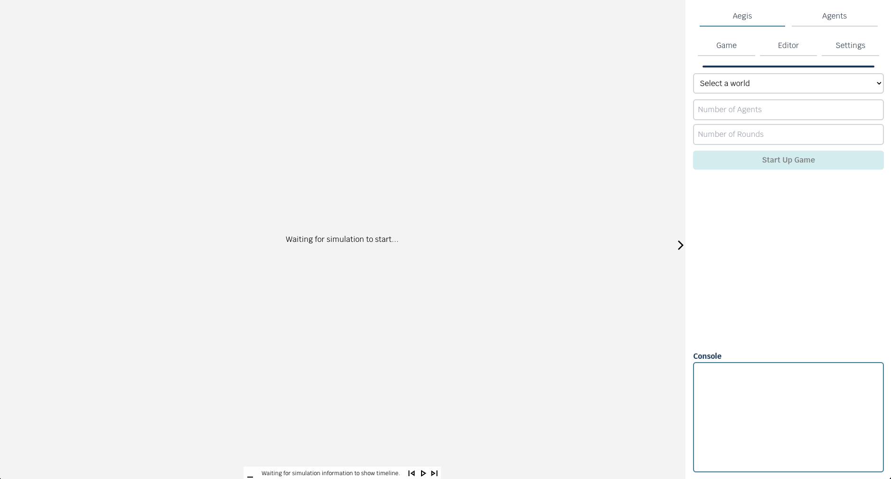
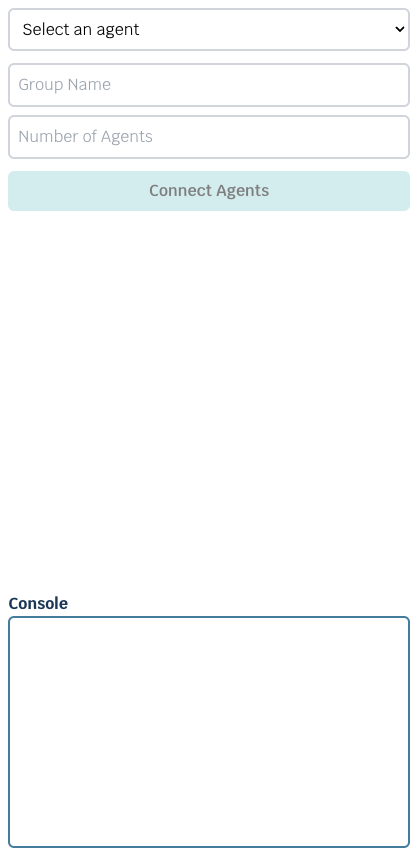
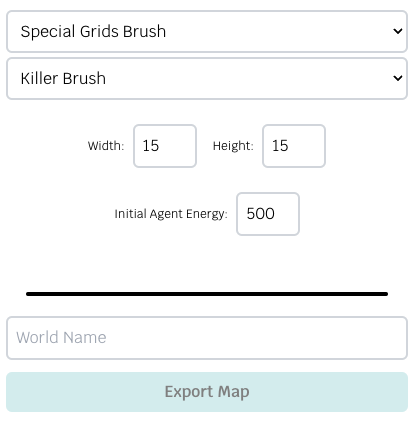
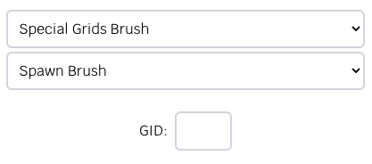
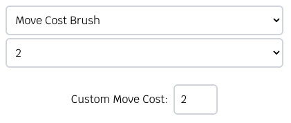
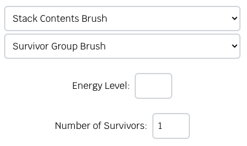
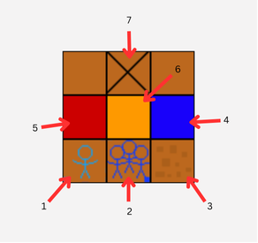
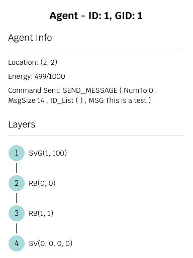
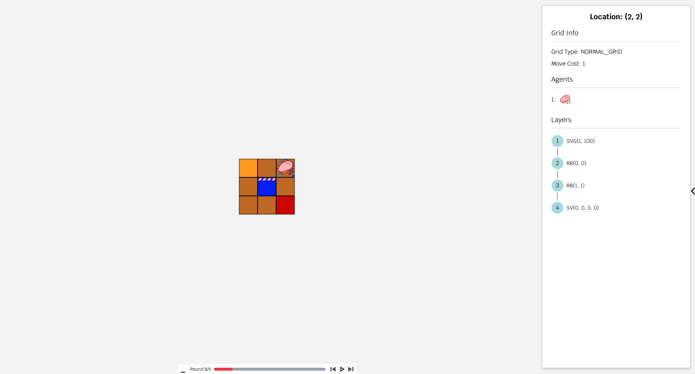

This section will cover the basics on how to use the client, covering its 
features and functionality to help you get started.

## Starting up the client

The client is built with Electron, so it works just like any other 
desktop application on your computer.

If you haven't setup your client head over [here](./running-aegis.md). 

Once you start up the client, your client will look something like this:

Since the client can't automatically find the AEGIS code, you'll need
to set it up manually.

Click on the ***Setup Aegis Path*** button, and select the AEGIS root directory. 

If set up properly, the client should look something like below and you should be able to see
a list of worlds when attempting to select one.

## Tabs

### Aegis 

This will allow you to start AEGIS. Note that AEGIS can only be launched after you 
have selected a world, set the number of agents, and set the number of rounds.

### Agents

This will allow you to connect the amount of agents you set when starting AEGIS.
You can connect different groups with varying numbers of agents and use different
agents in each group if you have multiple versions of your agent.

### Game

This tab will show you the stats above during a simulation.

### Editor

This will allow you to create custom worlds.

In the editor, you can use four different types of brushes:

- Special Grids Brush
- Move Cost Brush
- Stack Content Brush
- Empty Brush

To place something on the map simply left click on a grid. To delete,
ensure you have the proper brush selected.

For example, to delete a fire grid, you need to select the Special
Grids Brush with the Fire Brush option.
To delete an object from a stack, simply right-click on it. You do not
need to select the correct object first.

#### Special Grids Brush

##### Spawn

By default, the GID option is set to zero, which means any number of agents from any group
can spawn on that grid.

If the GID is set to another number, only one agent from the set GID will be able to
spawn on that grid. For that reason, stacking spawns is allowed.

##### Fire, Killer and Charging

These brushes have no settings.

#### Move Cost Brush

Every grid has a move cost of one, which is why the dropdown menu and custom move cost starts at 2.
If you don't want to use the values from 2-5, you can use the custom move cost to set a higher value.

The higher the move cost, the darker the grid colour will become. This helps you easily
identify the cost when your agents are moving through different grids.

#### Stack Content Brush

These objects can be placed on any grid except fire, killer and charging grids.

When you add an object to a stack, it will be placed at the bottom of the stack.

##### Rubble

Remove energy and agents are defaulted to zero.

##### Survivor

Energy level, body mass, damage factor and mental state are all defaulted to zero.

##### Survivor Group

Energy level is defaulted to zero, and number of survivors is defaulted to one.

#### Empty Brush

This brush will allow you to inspect the grids.

### Settings

If you decide to move the AEGIS code to a different location on your computer after 
the initial setup, you can reconfigure the path here.

### Client UI 

#### World Objects

Below is an example of all the world types and objects:

1. Represents a survivor.
2. Represents a survivor group.
3. Represents rubble.
4. Represents a charging grid.
5. Represents a killer grid.
6. Represents a fire grid.
7. Represents a spawn zone.

The small squares on the corner of a grid represent survivors and survivor groups in a stack. Light blue squares 
indicate the presence of survivors, while dark blue squares represent survivor groups.

For example, if a grid has 2 light blue squares and 4 dark blue squares, it means that there are 2 survivors
and 4 survivor groups located on that grid.

#### Timeline

- **Jump Between Rounds**: Click on the timeline to navigate directly to different rounds.

- **Previous and Next Buttons**: Use these buttons to move backward or forward by one round.

- **Play/Pause Button**: Click this button to start or pause the simulation.

- **Minimize Button**: The `_` button minimizes the timeline, allowing you to view behind it.

#### Info Panel

##### Grid Panel

Clicking on a grid will show the below information:

- The type of grid and move cost.
- Any agents present in the grid, sorted by group and ID.
- Any layers that exist in the grid.

##### Agent Panel

Clicking on an agent in the grid panel will show the below information:

- The current location of the agent.
- The current energy level of the agent.
- The latest command sent by the agent.
- Any layers that exist at the agent's current location.

#### Full Client Example

Now it's time to finally [run a simulation](running-aegis.md)!
